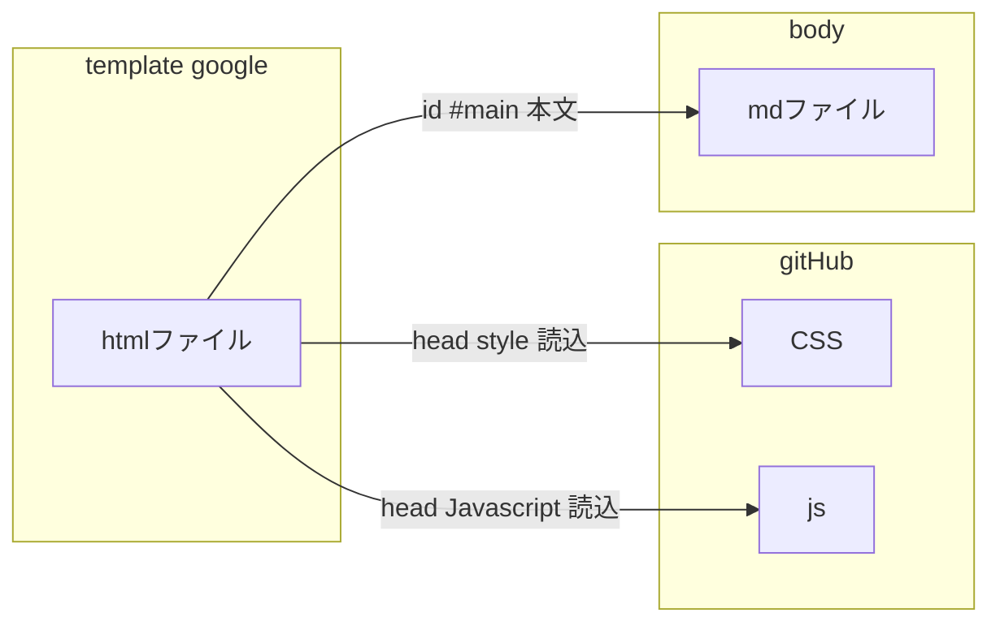
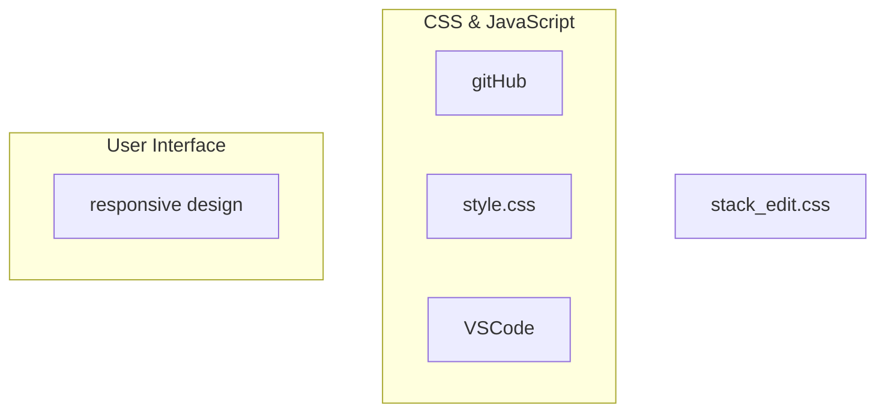

- [x] GitHubアカウント作成

    [無料アカウントでも非公開に設定できる](https://notepad-blog.com/content/59/)

    公開にしないとWEBページが表示されません
    すでにアカウントもっていました。

    [[HOME]](https://github.com/takemoto61)

    

    [ホームページ・更新の仕方](https://prog-8.com/docs/github-pages)

- [X] New Repository / [template]
- [X] Link to GitHub with VSCode
- [ ] responsive design index.html
- [ ] stack_edit.css 拡張 change to my own css
- [ ] stack_edit template を index.htmlを基準にして、作成

ホームページは、Google側で表示して、あくまでも、gitHubは、テンプレート作成のための CSS, JavaScriptを作成するためのものとする。

- [ ] stack_edit.css 必要なものを抜粋
    - [ ] KaTex class css

